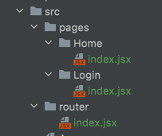
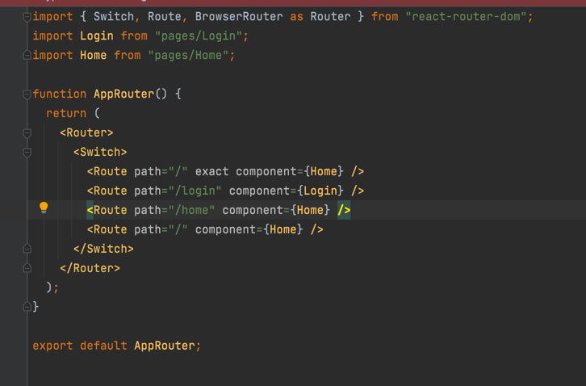
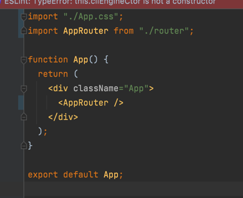
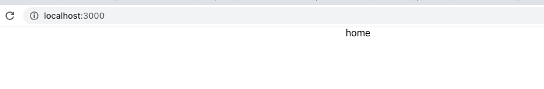
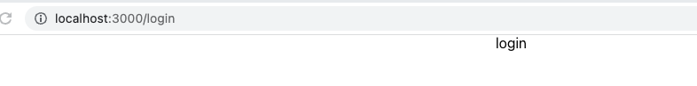
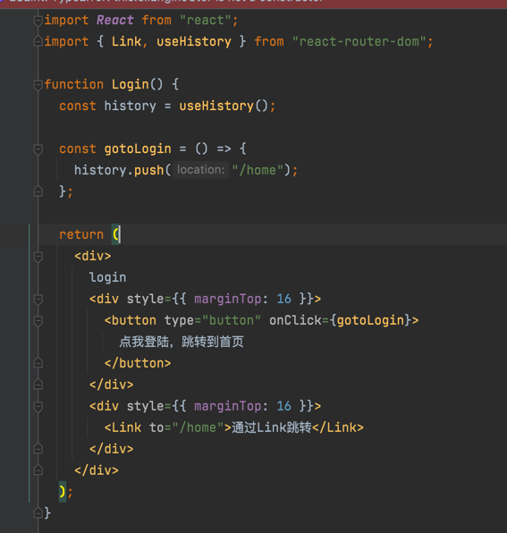
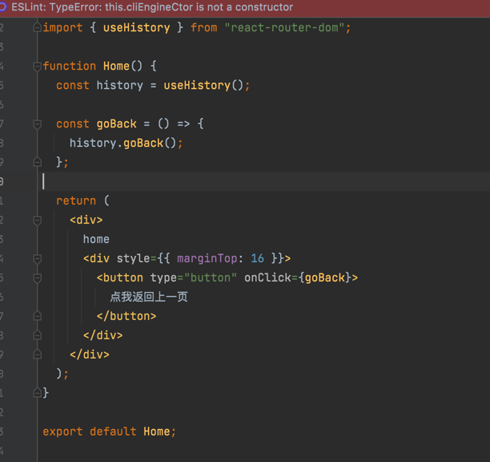
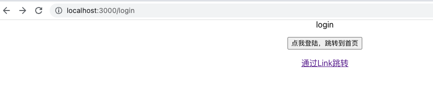
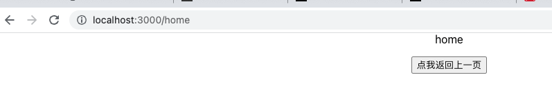

##配置路由

[官方文档](https://reactrouter.com/docs/en/v6/getting-started/installation)
1. 运行命令 `yarn add react-router-dom`
2. 在src文件夹下创建pages文件夹和router文件夹  
   

3. router文件夹下的index.jsx改成这样  
   

4. app.js 改成这样  
   

5. 在浏览器地址上刷新可以看到  
   

6. 将浏览器地址改成 `http://localhost:3000/login` ，可以看到
   

##路由跳转
1. 将Login文件改成这样  
   

2. 将Home文件改成这样  
   

效果图：  
Login  
  

Home
  

可以自行的修改下Login跟Home里面html部分的代码，看看页面有啥变化