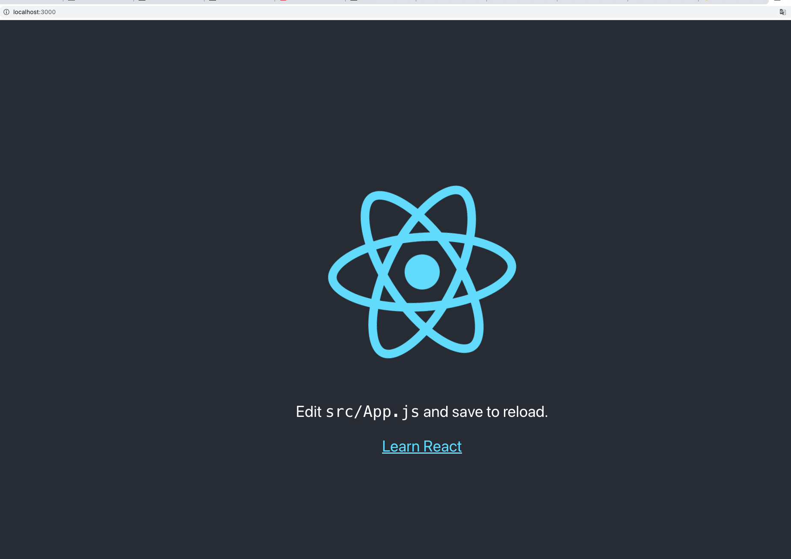

##创建React App
1. 打开终端，进入到你要创建项目的文件夹下，比如 `cd IdeaProject`
2. 运行命令 `yarn create react-app my-app`

此时安装的React版本是最新的，这里要注意16.8版本是React一个分界线。在此版本之前是Class组件，在此版本之后出现了React Hook，通俗讲就是函数组件。
这也是目前比较流行的用法，具体看[React文档](https://react.docschina.org)

##运行React App
1. 运行命令 `yarn instsall`，去掉install也可以，这是用来安装 [package.json](../package.json) 里面依赖的第三方包的
2. 运行命令 `yarn start`，这是用来启动项目的，具体对应 [package.json](../package.json) 里面 `scripts`下的start选项
3. 运行成功在浏览器访问 `http://localhost:3000/` 可以看到

这里简单介绍 [package.json](package.md) 这个文件的作用。  

看完上面（不看也可以）的文档记得继续下一步 [配置路由](route.md)。